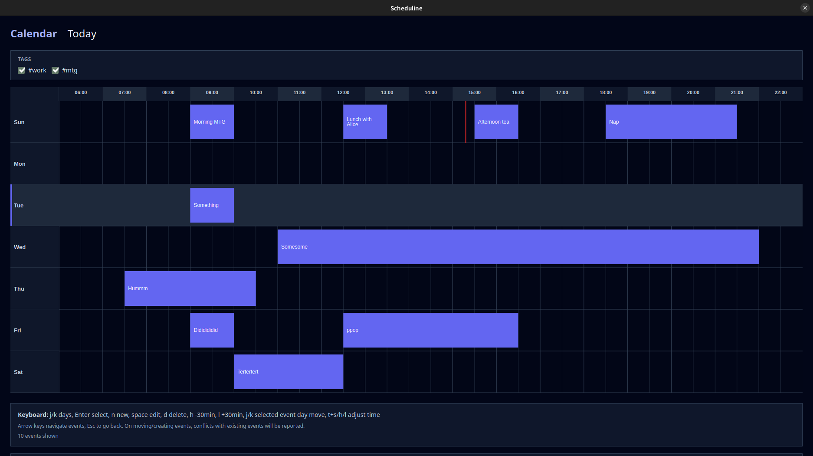
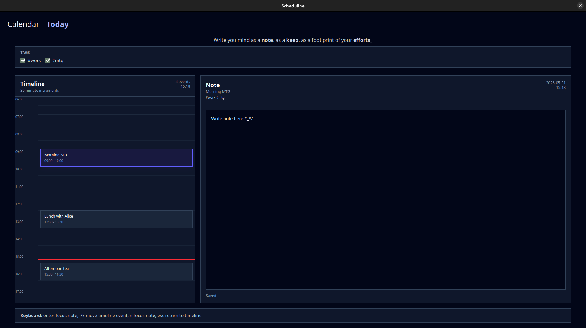

<div align="center">

</div>

# Scheduline

Scheduline is a desktop scheduling app for planning your day with a calendar and a Today view.

## What it does

- Browse and edit events in a week-based calendar
- Move events with keyboard shortcuts
- Keep daily notes linked to selected events
- Review today's timeline alongside the note editor
- Save data locally in IndexedDB

## Main screens

- **Calendar**: week view for creating, selecting, moving, and editing events



- **Today**: focused day view with a timeline and a note editor



## Running the app

```bash
bun install
bun run dev
bun run dev:hmr       # recommended for development (HMR)
bun run build:prod    # production build
```

## Build for distribution

```bash
bun run build:prod
```

The app is built for your current platform. Output goes to `build/`.

### Supported platforms

| Platform | Status |
|---|---|
| Linux | ✅ |
| Windows | ✅ |

> macOS is not currently supported.

### CI builds

GitHub Actions automatically builds Windows and Linux on every push to `main` using the matrix defined in `.github/workflows/build.yml`. Build artifacts are uploaded as workflow run artifacts.

## Project structure

```text
src/
  bun/        # app bootstrap
  mainview/   # React UI
```

## Notes

- Data is stored locally in the browser via IndexedDB
- The app is built with React, Tailwind CSS, Vite, and Electrobun
